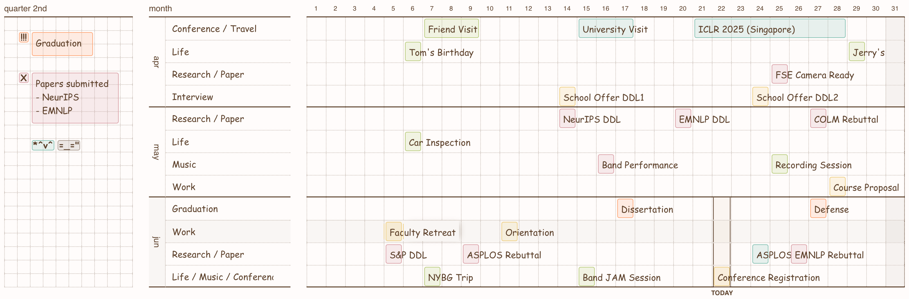

# GridCal

GridCal is a yearly tracker designed for visibility, minimalism, and usability.
It allows you to keep track of high-level events of the entire year.
It offers functionalities to create monthly topics and categorize events in a per-topic fashion.
For simplicity, each month only allows up-to 4 topics, making you aware of focuses and forcing you to prioritize.
The app offers local persistent storage as well as download/upload calendar functionality.



Implementation wise, it is a simplistic web-app built with React and [Next.js](https://nextjs.org).

## How to use


## Developing

First, run the development server:

```bash
npm run dev
```

Open [http://localhost:3000](http://localhost:3000) with your browser to see the result.
